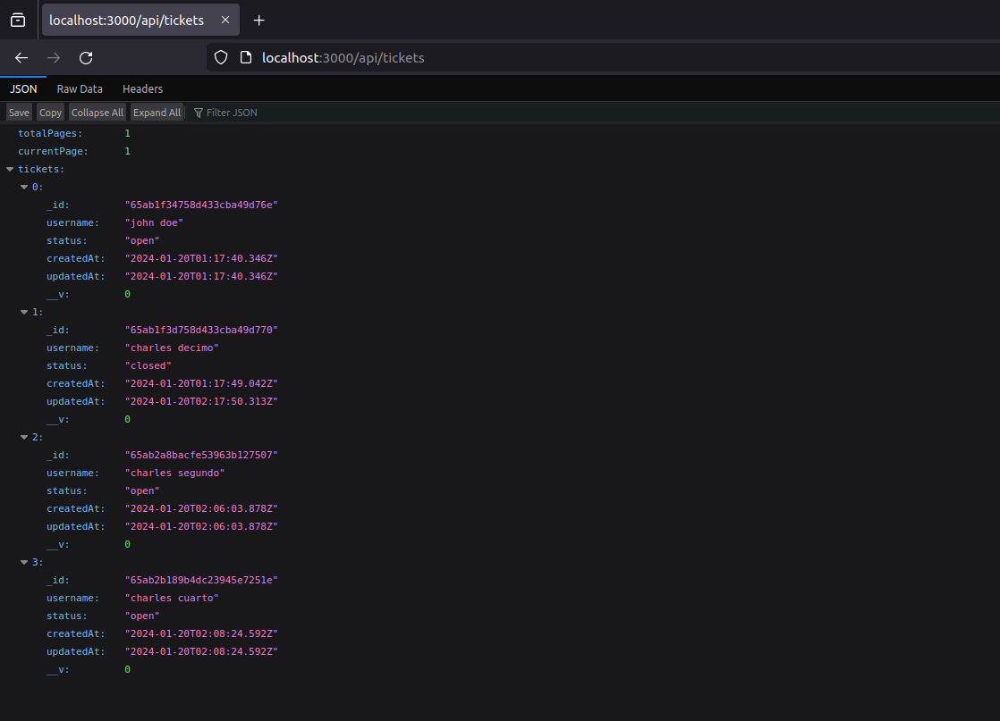
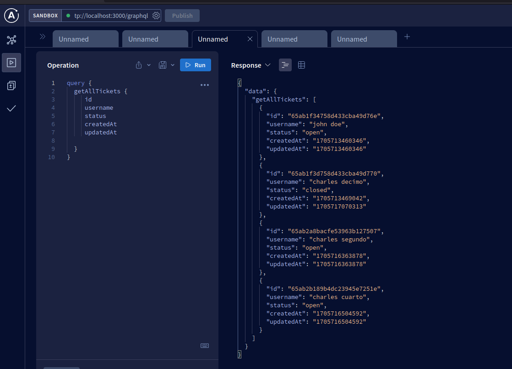
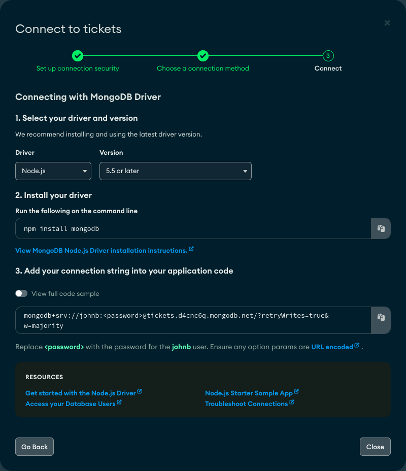
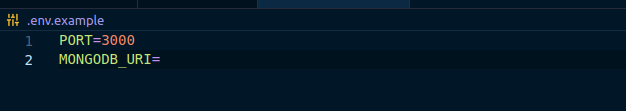

# API CRUD RESTFUL And GraphQL with Nodejs, Express, MongoDB




Restful API that allows create, delete, edit, and retrieve tickets with pagination, retrieving all or filtering for a specific one.

It implements GraphQL as an alternative query language for the API, using Apollo Server for Express.

API endpoint here: [https://tickets-api-production.up.railway.app/api/tickets](https://tickets-api-production.up.railway.app/api/tickets)

GraphQL endpoint here: [https://tickets-api-production.up.railway.app/graphql](https://tickets-api-production.up.railway.app/graphql)

---

## Features

In this project, it demonstrates the ability to:

- CRUD Operation on MongoDB.
- Implement routes to consume resources from an API.
- Pagination by query parameters.
- Implement GraphQL a new dynamic way of consulting resources.
- Server configuration through Nodejs with Express.

---

## Query settings and Endpoints

### EndPoints:

```bash
# GET ALL, POST
 /api/tickets

 # Pagination Queries
 /api/tickets/?page=1&limit=10

# GET, UPDATE, DELETE by Id
/api/tickets/:id

```

### GraphQL Query Examples:

```bash
# Queries
 query {
  getAllTickets {
     id
     username
     status
     createdAt
     updatedAt
  }
}

query {
  getTicket(id: "id") {
    id
     username
     status
     createdAt
     updatedAt
  }
}

# Mutations
mutation {
  createTicket(
    ticket: {
      username: "john doe",
      status: "open",
    })
   {
    id
    username,
    status
    }
}

mutation {
  updateTicket(
    id: "id"
    ticket: {
      username: "new name",
      status: 'close'
    })
   { id
    username,
    status}
}

mutation {
  deleteTicket(id: "id")
}

```

---

## 🚀 Build Setup

### Prerequisites:

- **Node version 14.x**

If you want to run the site locally, you can:

1. Clone the project.

```bash
https://github.com/Johndev85/tickets-api.git
```

2. Go to project's folder

```bash
cd tickets-api
```

3. Install dependencies:

```bash
npm i
```

4. Open server:

```bash
npm run dev
```

---

## 🛠 Settings

MongoDB setting alternatives:

- **[MongoDB Atlas](https://www.mongodb.com/atlas)** Free cloud database service.



- **[Docker MongoDB](https://hub.docker.com/_/mongo)** Mongodb image to install in an instance of Docker

1. Download image.

```bash
docker pull mongo
```

2. Run instance.

```bash
docker run -p :27017:27017 --name testdb mongo
```

3. Connect to MongoDB Server and create the DB:

```bash
mongo localhost:27017
```

4. Update Mongo URI into env file:



```bash
 mongodb://localhost/namedb
```

---

## Technologies

- Javascript
- Nodejs with Express
- MongoDB
- GraphQL With Apollo Server Express
- Railway deploy

---

## Contribute

If you want to contribute with this project, just make a Pull Request explaining the improving ✨.

---

## License

The MIT License (MIT)

---
